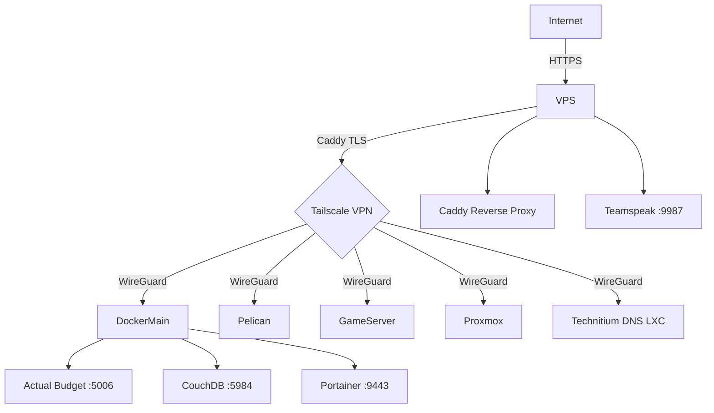

# Homelab
Self-hosted home lab

```mermaid
graph TD
    Internet -->|HTTPS| VPS
    VPS -->|Caddy TLS| TS{Tailscale VPN}
    TS -->|WireGuard| DockerMain
    TS -->|WireGuard| Pelican
    TS -->|WireGuard| GameServer
    TS -->|WireGuard| Proxmox
    TS -->|WireGuard| DNS

    DockerMain --> Actual[Actual Budget :5006]
    DockerMain --> CouchDB[CouchDB :5984]
    DockerMain --> Portainer[Portainer :9443]

    VPS --> Caddy[Caddy Reverse Proxy]
    VPS --> Teamspeak[Teamspeak :9987]

    DNS[Technitium DNS LXC]
```
